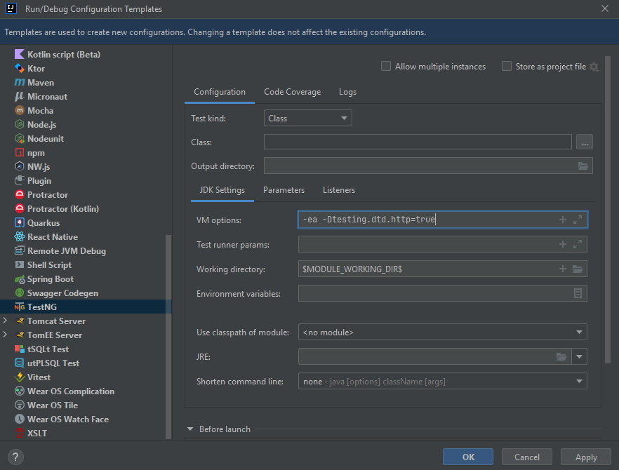
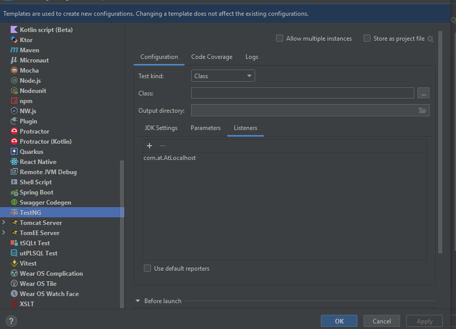
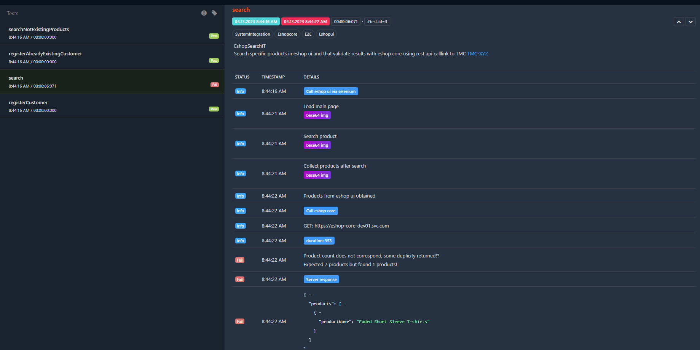

# automation
AT framework JAVA 17 - Rest + UI


## Execute

1. Create local.properties and add into src/test/resources
   com.at.ui.eshop.url=http://automationpractice.pl/index.php
2. ```mvn test ``` - unit test

3. ```mvn clean install ``` - all unit test (surfire plugin),
if all unit tests will pass then e2e test are executed (failsafe plugin)

E2E tests are based on TestNG framework and some global configurations have to be handled.
Go into Run > Edit Configurations... -> Edit configuration templates -> TestNG and add following command into VM options: -ea -Dtestng.dtd.http=true and add AtLocalhost.class 
See picture below:

Add ATLocalHost to testNG template so you will be able to automatically execute tests via IDEA not maven command



When you run test via maven command test with dataset will be market as child see picture bellow:


When you executed test via TestNG child logic will be not affected:


EXAMPLE
There is result from e2e tests which is combination UI (selenium) and REST API (dummy) data obtained in UI are validated against data from backend


# 🛠 Technologies
- Maven
- Git
- Java 17
- TestNG
- Selenium

# © License

[Apache2.0](https://www.apache.org/licenses/LICENSE-2.0)