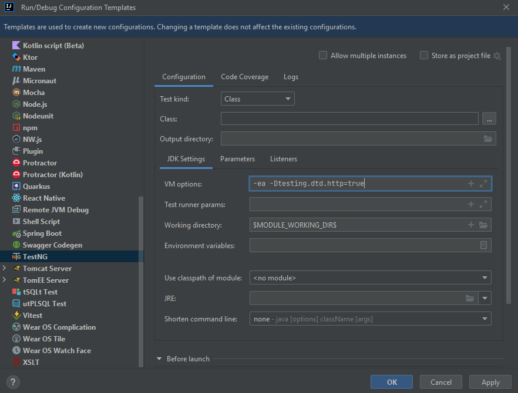
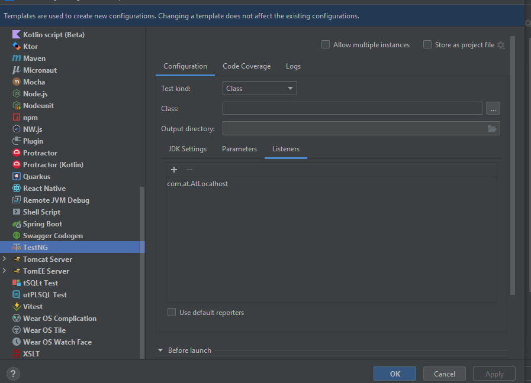
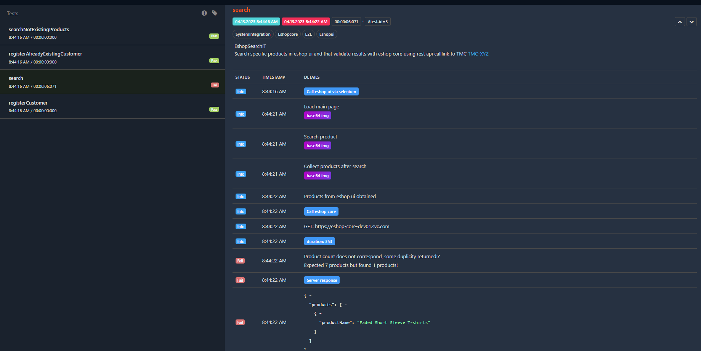

# Automation
This repository is practical shown for `Rest API` and `UI` tests with `HTML` results written in `Java SE 17`
There is also shown combination of `UI` and `REST API` test as one isolated test.
All execution is easily done with mvn command:

- Isolated REST API test (teamcity step after separated app is deployed) per environment
   ```bash
   mvn clean verify -P dev -Dfailsafe.suites=src/test/resources/suites/Rest.xml
   ```
- Isolated Petstore REST API test, its own suite, per environment (suites can differ per environment — e.g.
  `PetstoreStg.xml` could include extra staging-only classes; for now it mirrors `Petstore.xml`)
   ```bash
   mvn clean verify -P dev -Dfailsafe.suites=src/test/resources/suites/Petstore.xml
   mvn clean verify -P stg -Dfailsafe.suites=src/test/resources/suites/PetstoreStg.xml
   mvn clean verify -P prod -Dfailsafe.suites=src/test/resources/suites/Petstore.xml
   ```
- Isolated UI test (teamcity step after separated app is deployed)
   ```bash
   mvn clean verify -P dev -Dfailsafe.suites=src/test/resources/suites/Ui.xml
   ```
- Isolated System Integration E2E test between UI and CORE (should be executed manually when both systems are deployed)
  ```bash
  mvn clean verify -P dev -Dfailsafe.suites=src/test/resources/suites/EshopE2E.xml
  ```
That is shown how it could be easily executed for teamcity/jenkins plan. Before suites are executed by `failsafe plugin`
all unit tests run as first by `surfire` plugin. If some unit test fail E2E tests defined in xml suites will be not executed.

## Docker

Build once, run many times against different environments/suites — properties files hold config, not secrets, but are
never baked into the image (`src/test/resources/*.properties` is in `.dockerignore`).

This just (create → run tests → exit) - normally it would store reporting.html and logs to storage like GCP, Exoscale what ever.
```bash
docker build -t at-core:1.0.0 .

# dev, Rest suite
docker run -v "$(pwd)/src/test/resources/dev.properties:/app/config.properties" at-core:1.0.0 \
  -Dfailsafe.properties=/app/config.properties -Dfailsafe.suites=src/test/resources/suites/Rest.xml

# stg, UI suite
docker run -v "$(pwd)/src/test/resources/stg.properties:/app/config.properties" at-core:1.0.0 \
  -Dfailsafe.properties=/app/config.properties -Dfailsafe.suites=src/test/resources/suites/Ui.xml

# stg, Petstore suite
docker run -v "$(pwd)/src/test/resources/stg.properties:/app/config.properties" at-core:1.0.0 \
  -Dfailsafe.properties=/app/config.properties -Dfailsafe.suites=src/test/resources/suites/PetstoreStg.xml

# prod, Petstore suite
docker run -v "$(pwd)/src/test/resources/prod.properties:/app/config.properties" at-core:1.0.0 \
  -Dfailsafe.properties=/app/config.properties -Dfailsafe.suites=src/test/resources/suites/Petstore.xml
```

## Environments

Tests can be limited to certain environments. `createPet`/`deletePet` are tagged to only run against
`dev`/`stg`.
Read-only tests (like `getPets`) are tagged to always run everywhere. Untagged tests just always run, regardless of
environment.

## Execute

1. Create dev.properties and add into src/test/resources
   com.at.ui.eshop.url=http://automationpractice.pl/index.php
2. ```mvn test ``` - unit test

3. ```mvn clean verify ``` - all unit test (surfire plugin),
if all unit tests will pass then e2e test are executed (failsafe plugin)

E2E tests are based on TestNG framework and some global configurations have to be handled.
Go into Run > Edit Configurations... -> Edit configuration templates -> TestNG and add following command into VM options: -ea -Dtestng.dtd.http=true and add AtLocalhost.class 
See picture below:

Add ATLocalHost to testNG template so you will be able to automatically execute tests via IDEA not maven command



When you run test via maven command test with dataset will be market as child see picture bellow:


When you executed test via TestNG child logic will be not affected:


EXAMPLE
There is result from e2e tests which is combination UI (selenium) and REST API (dummy) data obtained in UI are validated against data from backend


# 🛠 Technologies
- Maven
- Git
- Java 17
- TestNG
- Selenium

# © License

[Apache2.0](https://www.apache.org/licenses/LICENSE-2.0)